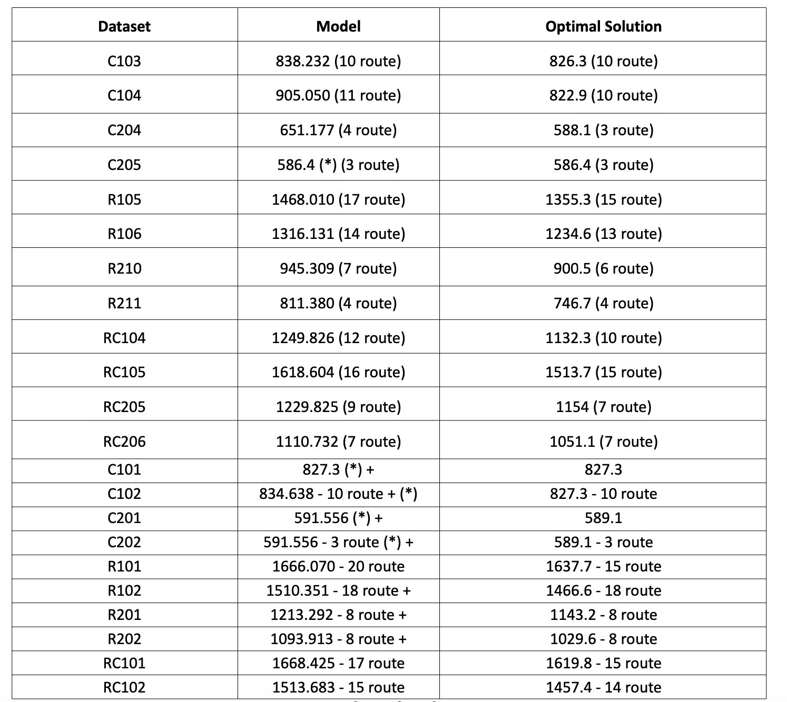

AMO-ACO Inference, based code here:
> [AMO-ACO](https://github.com/langkhachhoha/AMO-ACO-Model_Training_GECCO2024.git)
# How to run
Change cfg in **AMO-ACO.ipynb** to config suitable for your Dataset you want to run.

We have 3 options: Data_100, Data_200 and Data_400.

# Experimental Result

Average time for 100 node datasets is 400 seconds - 500 epochs.
# Ilustration Solution

